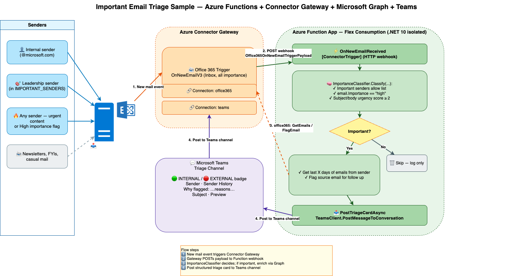

# Azure Functions Connectors Sample

This sample demonstrates how to use **Azure Functions** with **Connector Namespace connectors** to react to events from external services. It listens for new emails arriving in an Office 365 inbox, classifies each one with a small in-process importance heuristic, and — for the ones that pass the bar — enriches the message with **sender history** from the same mailbox, posts a formatted card to a **Microsoft Teams** channel, and **flags the source email** in Outlook so the recipient also has a server-side follow-up reminder.

## Architecture



> Editable source: [docs/architecture.drawio](docs/architecture.drawio) (open with [draw.io](https://app.diagrams.net)).

- **Azure Functions (Flex Consumption)** — A .NET 10 isolated worker function app that receives HTTP callbacks from the Connector Namespace.
- **Connector Namespace** — Manages three connections (Office 365, Teams, Office 365 Users) and the Office 365 trigger configuration.
- **Office 365 Outlook Connector** — Used in two ways:
  - As a **trigger** — the gateway watches the Inbox (`folderPath: Inbox`) and calls the function for every new email.
  - As a **client** inside the function — `GetEmailsAsync` to fetch sender history (last N messages from the same sender), and `FlagAsync` to set the Outlook follow-up flag on the source email when it's classified as important. Scales to any tenant size because everything is scoped to the watched mailbox — no directory enumeration required.
- **Teams Connector** — Posts the enriched triage card to a configured Teams channel.
- **Office 365 Users Connector** — Looks up the sender's M365 user profile (`UserProfileAsync`) to determine whether they are in the org. A successful lookup means the sender is an org user (🟢 IN-ORG badge); a 404 means external (🔴 EXTERNAL badge). When the profile is found the card is also enriched with the sender's job title, department, and manager display name (via `ManagerAsync`). To keep this API off the hot path for clearly external mail, configure the optional `INTERNAL_DOMAINS` setting (comma-separated, e.g. `microsoft.com,contoso.com`) — only senders whose domain matches will be looked up. Leave it empty to look up every sender.

## Prerequisites

- [Azure Developer CLI (azd)](https://learn.microsoft.com/azure/developer/azure-developer-cli/install-azd)
- [Azure CLI](https://learn.microsoft.com/cli/azure/install-azure-cli)
- [.NET 10 SDK](https://dotnet.microsoft.com/download/dotnet/10.0)
- [Azure Functions Core Tools v4](https://learn.microsoft.com/azure/azure-functions/functions-run-local)
- [jq](https://jqlang.github.io/jq/) (required by the post-deploy script on Linux/macOS)
- An Azure subscription
- An Office 365 account (for the email connector)

## Getting Started

### 1. Clone This Repository

```bash
git clone <url>/FunctionAppConnectorsEmailProcessor
cd FunctionAppConnectorsEmailProcessor
```

### 2. Restore and Build (Optional Local Validation)

```bash
cd function-app
dotnet restore
dotnet build
```

### 3. Deploy to Azure

```bash
azd up
```

This provisions all infrastructure (Function App, Connector Namespace, Storage, Application Insights) and deploys the function code. After deployment, a post-deploy script automatically creates the Connector Namespace trigger configuration.

### 4. Authorize the Connections

> **⚠️ Important:** After deployment, you **must** authorize all connector connections in the Azure portal before the end-to-end flow will work. Each connection is created in a disabled state and requires OAuth consent.

1. Open the Connector Namespaces portal.
2. Navigate to the Connector Namespace created by the deployment.
3. Go to **Connections** and authorize each connection in turn:
   - **Office 365** — sign in with the account whose inbox you want to monitor (drives the trigger, sender-history lookup, and follow-up flag).
   - **Teams** — sign in with an account that can post to the target Teams channel.
   - **Office 365 Users** — sign in with an account that has permission to read user profiles in the directory. Used for `UserProfileAsync` (IN-ORG badge) and `ManagerAsync` (manager enrichment on the triage card).

Until the connections are authorized, the trigger will not fire, notifications will fail, and/or the `IN-TEAM` badge will be omitted.

## Environment Variables

| Name | Description |
|---|---|
| `TEAMS_TEAM_ID` | Teams team/group ID where triage cards are posted. |
| `TEAMS_CHANNEL_ID` | Teams channel ID where triage cards are posted. |
| `IMPORTANT_SENDERS` | Optional comma-separated email allowlist whose messages always count as important. |

### 5. Test the Solution

Once the connections are authorized, send an email to the authorized account. The function classifies it via [function-app/ImportanceClassifier.cs](function-app/ImportanceClassifier.cs); for important ones it (1) calls the Office 365 connector to get the sender's recent history across the Inbox and Archive folders, (2) posts an enriched triage card to the configured Teams channel, and (3) flags the source email in Outlook.

You can also manually test the function endpoint using the [test.http](test.http) file (update the URL and function key to match your deployment).

## Project Structure

| Path | Description |
|---|---|
| `function-app/` | Azure Functions application (.NET 10, isolated worker) |
| `function-app/ProcessEmail.cs` | Function triggered for every new email; classifies importance, looks up sender history via the Office 365 connector, posts to Teams, and flags the source email |
| `function-app/Program.cs` | Host builder, registers Teams, Office 365, and Office 365 Users connector clients |
| `infra/main.bicep` | Main Bicep template for all Azure resources |
| `infra/connectorNamespace.bicep` | Connector Namespace plus Office 365, Teams, and Office 365 Users connection resources |
| `infra/scripts/postdeploy.sh` | Post-deploy script (Linux/macOS) — creates the Office 365 trigger config |
| `infra/scripts/postdeploy.ps1` | Post-deploy script (Windows) — creates the Office 365 trigger config |
| `azure.yaml` | Azure Developer CLI project configuration |
| `test.http` | Sample HTTP request for manual testing |

## Resources

- [Azure Functions documentation](https://learn.microsoft.com/azure/azure-functions/)
- [Azure Functions Flex Consumption plan](https://learn.microsoft.com/azure/azure-functions/flex-consumption-plan)
- [Azure Developer CLI (azd)](https://learn.microsoft.com/azure/developer/azure-developer-cli/)
