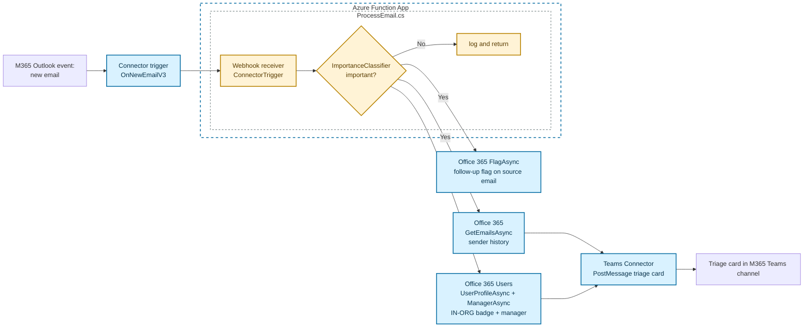

# Triage new M365 emails into Teams channels with Azure Functions + Connector Namespaces

Plenty of important work still arrives by email. Support inboxes (`support@`, `help@`), alert mailboxes that catch monitoring digests, contact forms that post into a shared inbox, vendor escalations, on-call pager mail. The pattern is the same: every new message needs a quick classify-and-route step, and the routing target is usually some system you already run (Teams for visibility, a ticketing tool for follow-up, a database for the audit trail).

This sample is that pattern, packaged so you can run it end to end against your own M365 mailbox and your own Teams channel. A **Connector Namespace** trigger watches the M365 Outlook Inbox and POSTs every new email to an **Azure Functions** webhook URL. The function classifies importance with a small in-process .NET heuristic, and for the messages that pass the bar it enriches them with sender history (Office 365 Outlook), an IN-ORG / EXTERNAL badge + manager (Office 365 Users), posts a triage card to a configured Teams channel, and flags the source email in Outlook for a server-side follow-up reminder. Three M365 connections, one OAuth grant each, no MCP server, no broker, no per-event compute.

**Architecture**: a Connector Namespace (`Microsoft.Web/connectorGateways`) owns three connections — `office365`, `teams`, `office365users` — and one `triggerConfig` (`OnNewEmailV3`). When the trigger fires, the Connector Namespace POSTs the email payload to the function's webhook URL (the function-app `connector_extension` system key in the query string is the auth boundary). Inside the function, `[ConnectorTrigger]` deserializes the payload, the in-process classifier decides if it's important, and the same Connector Namespace is used as a **client** for the SendMail / GetEmails / Flag / UserProfile / Manager / PostMessage calls — all through the same three connections, all authenticated by the function-app's managed identity via the connection's access policy.



> Editable source for the full architecture: [docs/architecture.drawio](docs/architecture.drawio) (open with [draw.io](https://app.diagrams.net)) — also rendered as [docs/architecture.png](docs/architecture.png).
>
> Useful contrast to the [`ACA Sandboxes` scenarios 10 (email triage)](https://github.com/Azure-Samples/azure-container-apps-sandboxes/tree/main/python/samples/10-connectors-email-triage) and [11 (document automation)](https://github.com/Azure-Samples/azure-container-apps-sandboxes/tree/main/python/samples/11-connectors-document-automation), which run an **Azure Container Apps sandbox** as the compute (per-event Linux box, Copilot CLI inside). Pick **this** sample when you already have a Functions estate, want classic FaaS scaling and tooling, and don't need per-event isolation or in-sandbox tool execution.

## Deploy and test

### Prerequisites

- [Azure Developer CLI (azd)](https://learn.microsoft.com/azure/developer/azure-developer-cli/install-azd)
- [Azure CLI](https://learn.microsoft.com/cli/azure/install-azure-cli)
- [.NET 10 SDK](https://dotnet.microsoft.com/download/dotnet/10.0)
- [Azure Functions Core Tools v4](https://learn.microsoft.com/azure/azure-functions/functions-run-local)
- [jq](https://jqlang.github.io/jq/) (required by the post-deploy script on Linux/macOS)
- An Azure subscription
- An M365 mailbox and an M365 Teams channel you can post into

### 1. Sign in

```bash
azd auth login
az login
```

### 2. Configure the Teams channel

The function never discovers which channel to post to — you pin one specific Teams channel at deploy time.

In Microsoft Teams (desktop or web), right-click the target channel → **Get link to channel** → **Copy**. The link looks like:

```
https://teams.microsoft.com/l/channel/19%3aXXXXXXXXXXXXXXXX%40thread.tacv2/General?groupId=00000000-1111-2222-3333-444444444444&tenantId=...
```

- **Team ID** = the `groupId` query parameter
- **Channel ID** = the segment after `/channel/`, URL-decoded (replace `%3a` with `:` and `%40` with `@`), e.g. `19:XXXXXXXXXXXXXXXX@thread.tacv2`

Set them in azd:

```bash
azd env set TEAMS_TEAM_ID "<your-team-id>"
azd env set TEAMS_CHANNEL_ID "<your-channel-id>"
```

### 3. Deploy

```bash
azd up
```

This provisions all infrastructure (Function App on Flex Consumption, Connector Namespace + 3 connections + access policies, Storage, Application Insights), deploys the function code, then runs `infra/scripts/postdeploy.{sh,ps1}` to create the `OnNewEmailV3` trigger config and walk you through OAuth consent.

### 4. Consent to OAuth

Post-deploy opens **three** browser tabs in sequence. For each, sign in with the appropriate account and click **Accept**:

- `office365` — the M365 mailbox whose Inbox you want to monitor (drives the trigger, sender-history lookup, and follow-up flag).
- `teams` — an account that can post to the target Teams channel.
- `office365users` — an account that can read user profiles in your tenant (for `UserProfileAsync` / `ManagerAsync`).

Until all three are authorized, the trigger won't fire, Teams notifications will fail, and/or the IN-ORG badge will be omitted.

### 5. Send a test email

Send an email to the mailbox you consented in step 4 (a subject containing a bracketed urgency tag like `[URGENT]` or a known leadership sender are quick ways to trip the classifier — see [`ImportanceClassifier.cs`](function-app/ImportanceClassifier.cs) for the full rules). Within a few seconds, you should see a triage card land in the pinned Teams channel, and a follow-up flag appear on the source email in Outlook.

You can also exercise the function endpoint directly with the canned payloads in [`test.http`](test.http) (update the URL and function key to match your deployment).

## Clean up

```bash
azd down --purge --force
```

> `azd down` does **not** revoke the per-user OAuth consent grants the three connections registered in your AAD tenant. Those grants live on your identity (visible at <https://myapps.microsoft.com>), not on the ARM connection. They're harmless: the next `azd up` will re-use them. Revoke them manually from MyApps if you want a fully clean tenant.

---

## How it works

```
new email in M365 Outlook mailbox
    │  (Connector Namespace fires OnNewEmailV3 on the watched folder)
    ▼
Connector Namespace triggerConfig
    │  POST callbackUrl
    │  callback URL is:
    │    https://<funcapp>.azurewebsites.net/runtime/webhooks/connector
    │       ?functionName=<office365FunctionName>
    │       &code=<connector_extension system key>
    │  the system key + per-function name is the auth boundary —
    │  only the Connector Namespace knows the URL the postdeploy
    │  script registered, and only that key is honored
    ▼
Azure Function App — Flex Consumption, System-Assigned MI
    │  [ConnectorTrigger()] deserializes the payload
    │  ImportanceClassifier.IsImportant(email) — small in-process
    │  heuristic (IMPORTANT_SENDERS allowlist, urgency tags, etc.)
    │
    │  if NOT important:  log + return  (no side effects)
    │  if important:      enrich, post, flag (in parallel)
    ▼
Same Connector Namespace, three connections, three clients:
    │
    │  office365.GetEmailsAsync(folder=Inbox|Archive,
    │      from=<sender>, top=10)  → sender-history pane on the card
    │
    │  office365users.UserProfileAsync(<sender>)  → IN-ORG badge
    │  office365users.ManagerAsync(<sender>)      → manager name
    │  (gated by optional INTERNAL_DOMAINS prefilter so external
    │   senders skip the directory call entirely)
    │
    │  teams.PostMessage(teamId, channelId, <triage card>)
    │  office365.FlagAsync(<message-id>)  → follow-up flag in Outlook
    │
    │  Every call is authenticated by the function-app SystemAssigned
    │  MI via the per-connection accessPolicies entry that Bicep
    │  created at deploy time.
    ▼
Triage card delivered in M365 Teams channel
Follow-up flag set on the source email in Outlook
```

### What `azd up` did for you

[`infra/main.bicep`](infra/main.bicep) provisions the function app + storage + Application Insights and calls [`infra/connectorNamespace.bicep`](infra/connectorNamespace.bicep), which creates:

1. The Connector Namespace (`Microsoft.Web/connectorGateways`) with a SystemAssigned MI
2. The three connections (`office365`, `teams`, `office365users`) under that namespace
3. Per-connection access policies for the function-app MI **and** the deploying user (so you can run/debug locally with `az login` credentials)

Then [`infra/scripts/postdeploy.{sh,ps1}`](infra/scripts) runs:

1. Installs the official [`connector-namespace` Azure CLI extension](https://github.com/Azure/Connectors) from the latest GitHub release (pin a specific version with `CONNECTOR_NAMESPACE_EXT_URL` before running `azd up`)
2. Fetches the function app's `connector_extension` system key and builds the webhook callback URL
3. Creates the `OnNewEmailV3` trigger config (best-effort delete-first for idempotency), POSTing payloads to that callback URL on every new email in the Inbox
4. Walks you through OAuth consent for each of the three connections (step 4 above) by calling `connection list-consent-links` and opening the returned URL in a browser, then polling `connection show` until `properties.overallStatus` flips to `Connected`

### How the Connector Namespace authenticates its callback to the Function

The trigger callback URL contains the function app's `connector_extension` system key:

```
https://<funcapp>.azurewebsites.net/runtime/webhooks/connector
   ?functionName=<office365FunctionName>
   &code=<connector_extension system key>
```

That key + the `?functionName=` filter is the inbound auth boundary. The Connector Namespace is the only party that knows the URL the post-deploy script registered, and the Functions runtime rejects any call that doesn't carry a valid `connector_extension` key. Rotating the key (`az functionapp keys set --key-type systemKey --key-name connector_extension`) invalidates the registered URL — re-run the post-deploy script to register a fresh one.

### How the Function authenticates its callbacks INTO the connector

Outbound — when the function asks for sender history, looks up a profile, posts to Teams, or flags the source email — it talks to the **runtime URL** of each connection (`https://<host>/...`). Each request carries an Entra Bearer token for the function app's SystemAssigned MI; the Connector Namespace runtime checks the connection's `accessPolicies[]` (created in Bicep) and rejects calls from any principal that isn't on the list. The function app code never sees a connection secret.

### Why three connections (and three OAuth grants)

In M365, each connector is its own OAuth surface: `office365` (mail.read + mail.send + mail.readwrite for the flag), `teams` (channel post), `office365users` (directory read). A single grant can't span them, and consolidating them would force one identity to hold a strictly larger permission set than it needs for any single action. Keeping them separate also lets you back each connection with a different M365 account if you want the Teams post to come from a service account instead of the consented mailbox.

### IN-ORG badge and manager enrichment (optional `INTERNAL_DOMAINS` prefilter)

By default, every sender is looked up in the directory (`UserProfileAsync`) — a 200 response means in-org (🟢), a 404 means external (🔴). If you set the `INTERNAL_DOMAINS` setting (comma-separated, e.g. `microsoft.com,contoso.com`), the directory call is skipped for senders whose domain isn't on the list, and they're treated as external. That keeps the `UserProfileAsync` / `ManagerAsync` calls off the hot path for clearly-external mail. When the profile is found, the card is also enriched with the sender's `jobTitle`, `department`, and manager `displayName`.

## Environment variables

| Name | Required | Default | Description |
|---|---|---|---|
| `TEAMS_TEAM_ID` | yes | — | Teams team / group ID where triage cards are posted. |
| `TEAMS_CHANNEL_ID` | yes | — | Teams channel ID where triage cards are posted. |
| `IMPORTANT_SENDERS` | no | empty | Comma-separated email allowlist whose messages always count as important. |
| `INTERNAL_DOMAINS` | no | empty | Comma-separated domain allowlist. If set, only matching senders are looked up in the directory; non-matches are treated as EXTERNAL without an API call. Leave empty to look up every sender. |
| `CONNECTOR_NAMESPACE_EXT_URL` | no | latest from `Azure/Connectors` releases | Pin a specific `connector_namespace*.whl` URL for the post-deploy script's CLI extension install. |

## Project structure

| Path | Description |
|---|---|
| [`function-app/`](function-app) | Azure Functions application (.NET 10, isolated worker) |
| [`function-app/ProcessEmail.cs`](function-app/ProcessEmail.cs) | `[ConnectorTrigger]` function entry point: classify, enrich, post to Teams, flag the source email |
| [`function-app/ImportanceClassifier.cs`](function-app/ImportanceClassifier.cs) | In-process importance heuristic (sender allowlist, urgency tags, etc.) |
| [`function-app/Program.cs`](function-app/Program.cs) | Host builder; registers the three connector clients (Office 365, Teams, Office 365 Users) |
| [`infra/main.bicep`](infra/main.bicep) | Main Bicep template — function app, storage, App Insights, settings |
| [`infra/connectorNamespace.bicep`](infra/connectorNamespace.bicep) | Connector Namespace + three connections + per-connection access policies for the function-app MI and the deploying user |
| [`infra/scripts/postdeploy.sh`](infra/scripts/postdeploy.sh) | Bash post-deploy: install the official `connector-namespace` CLI extension, create the trigger config, walk OAuth consent |
| [`infra/scripts/postdeploy.ps1`](infra/scripts/postdeploy.ps1) | PowerShell mirror of the above |
| [`azure.yaml`](azure.yaml) | `azd` project configuration |
| [`test.http`](test.http) | Canned payloads for hitting the function endpoint directly during development |

The CLI flavor of the same architecture lives at [`docs/DEMO.md`](docs/DEMO.md) — useful for walking through the sample step by step in a presentation.

## Going further

- **Move the classifier off the hot path.** `ImportanceClassifier` is a heuristic on purpose — it's deterministic, fast, and free. Swap it for a call to GitHub Models / Azure OpenAI / a small classifier model when you want the importance decision to depend on the message body or thread history, not just metadata.
- **Add a different sink.** The function holds the three connector clients (Office 365 / Teams / Office 365 Users) in DI; adding a fourth (e.g. ServiceNow, PagerDuty, a row in Cosmos DB) is a Bicep-side connection + an OAuth tab + a new client registration in `Program.cs`.
- **Re-run authorization manually.** If a token expires or you swap the account behind a connection, re-run the relevant `az connector-namespace connection list-consent-links` + open-in-browser flow, or just re-run `infra/scripts/postdeploy.{sh,ps1}` — it short-circuits if a connection is already `Connected`.
- **Iterate without re-provisioning.** Re-run just the function code with `azd deploy function-app` after editing `ProcessEmail.cs` / `ImportanceClassifier.cs`. The Connector Namespace, connections, ACLs, and trigger config persist.

## Resources

- [Azure Functions documentation](https://learn.microsoft.com/azure/azure-functions/)
- [Azure Functions Flex Consumption plan](https://learn.microsoft.com/azure/azure-functions/flex-consumption-plan)
- [Azure Developer CLI (azd)](https://learn.microsoft.com/azure/developer/azure-developer-cli/)
- [`azure-container-apps-sandboxes` scenario 10 — email triage in a sandbox](https://github.com/Azure-Samples/azure-container-apps-sandboxes/tree/main/python/samples/10-connectors-email-triage) (the sandbox-based counterpart to this sample)
